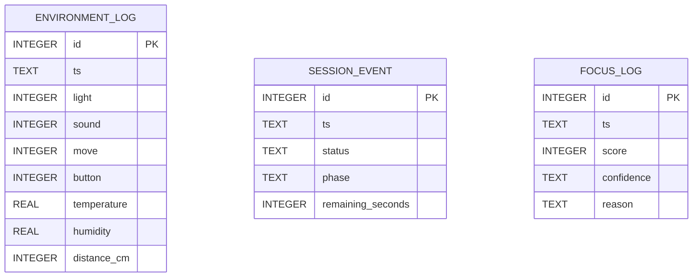
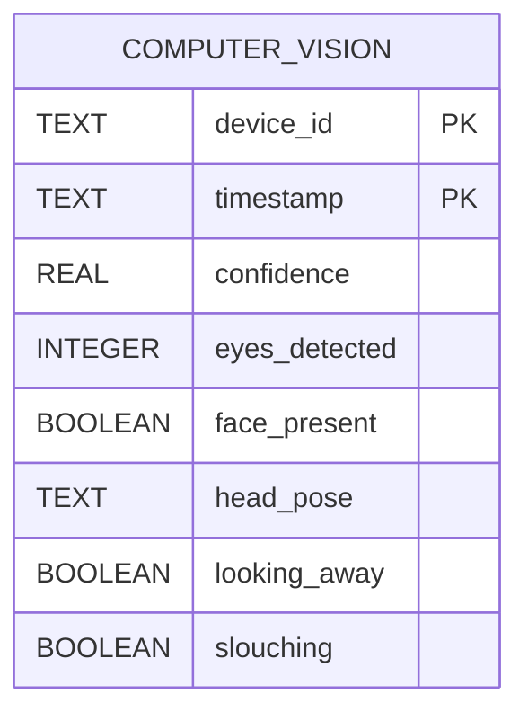

# Data Model And Storage

## Storage Rules

- SQLite on the hub is the source of truth.
- Write local first, sync later.
- Thread-safe operations using locks for concurrent access.

## Core Tables

- environment_log: raw sensor readings from the environment.
- session_event: session lifecycle and phase tracking events.
- focus_log: computed focus scores and analysis results.

## SQLite Schema

```sql
CREATE TABLE environment_log (
    id INTEGER PRIMARY KEY AUTOINCREMENT,
    ts TEXT NOT NULL,
    light INTEGER,
    sound INTEGER,
    move INTEGER,
    button INTEGER,
    temperature REAL,
    humidity REAL,
    distance_cm INTEGER
);

CREATE TABLE session_event (
    id INTEGER PRIMARY KEY AUTOINCREMENT,
    ts TEXT NOT NULL,
    status TEXT NOT NULL,
    phase TEXT NOT NULL,
    remaining_seconds INTEGER NOT NULL
);

CREATE TABLE focus_log (
    id INTEGER PRIMARY KEY AUTOINCREMENT,
    ts TEXT NOT NULL,
    score INTEGER NOT NULL,
    confidence TEXT NOT NULL,
    reason TEXT NOT NULL
);
```

## Relationships

- environment_log: independent periodic sensor readings.
- session_event: independent session state changes and phase tracking.
- focus_log: independent computed focus analysis results.

## ERD



## AWS DynamoDB (Computer Vision)

- Table name: `computer_vision`
- Partition key: `device_id` (String)
- Sort key: `timestamp` (String)

Attributes:

- `device_id` (String)
- `timestamp` (String)
- `confidence` (Number or String)
- `eyes_detected` (Number)
- `face_present` (Boolean)
- `head_pose` (String)
- `looking_away` (Boolean)
- `slouching` (Boolean)

Example DynamoDB item (JSON):

```json
{
  "device_id": "device-123",
  "timestamp": "2026-05-03T12:34:56Z",
  "confidence": 0.92,
  "eyes_detected": 2,
  "face_present": true,
  "head_pose": "forward",
  "looking_away": false,
  "slouching": false
}
```

Mermaid ERD addition:



## Data Access Patterns

- `write_environment()`: Insert periodic sensor readings with full payload.
- `write_session_event()`: Insert session state and phase changes.
- `write_focus()`: Insert computed focus analysis results.
- `latest_environment()`: Retrieve most recent sensor reading.
- `latest_session_event()`: Retrieve most recent session state.
- `latest_focus()`: Retrieve most recent focus analysis.

## Retention Defaults

- environment_log: every 1-5 seconds (managed by application logic).
- session_event: key state transitions throughout session.
- focus_log: every 30 seconds (managed by application logic).
