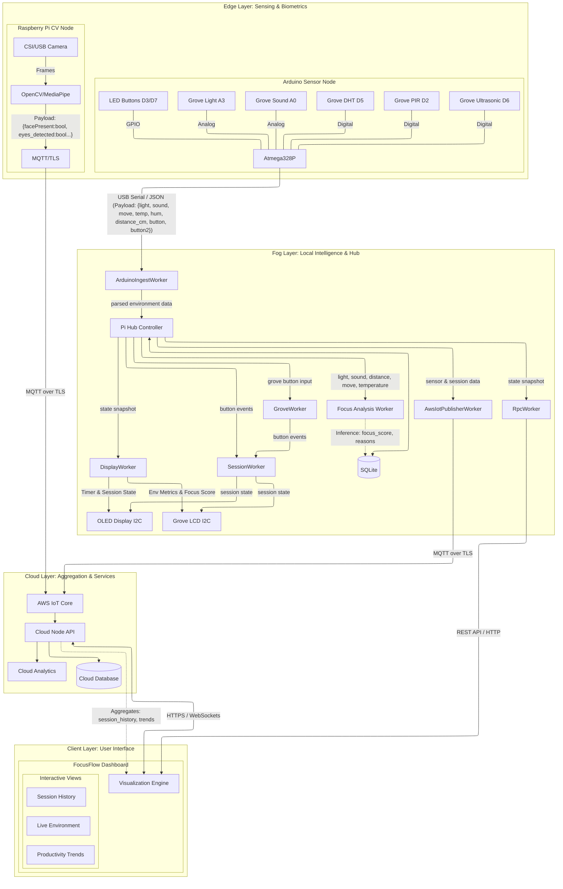

# System Architecture

The FocusFlow system follows a tiered IoT architecture (Edge, Fog, Cloud) designed for real-time focus monitoring and productivity enhancement.

## High-Level Diagram

## 1. System Components

### Edge Layer

- **Arduino Sensor Node**: A microcontroller-based unit that handles environmental sensing and physical user interaction (buttons).
- **Raspberry Pi CV Node**: A dedicated computer vision unit that processes video streams locally to extract focus-related biometric signals.

### Fog Layer

- **Raspberry Pi Hub**: The "brain" of the local environment. It orchestrates data ingestion, runs the local session manager (Pomodoro logic), and computes the real-time **Focus Score**.
- **Local Storage (SQLite)**: Ensures "local-first" operation, allowing the system to function without an internet connection.

### Cloud Layer

- **AWS IoT Core**: Acts as the secure message broker for device-to-cloud communication.
- **Cloud Node Services**: Handles long-term persistence, cross-session analytics, and serves the user-facing API.

### Client Layer

- **FocusFlow Dashboard**: A modern web application for real-time monitoring, historical review, and system configuration.

---

## 2. Data Types & Collection

| Category          | Data Points                                                              | Collection Method                          |
| :---------------- | :----------------------------------------------------------------------- | :----------------------------------------- |
| **Environmental** | `light_level`, `sound_level`, `temp`, `humidity`, `movement`, `distance` | Periodic sampling (1Hz - 5Hz) via Arduino  |
| **Biometric**     | `face_present`, `looking_away`, `head_pose`, `slouching`                 | Local CV inference on Pi (2s interval)     |
| **Session**       | `status` (running/paused), `phase` (work/break), `duration`              | Event-driven state transitions in Fog Node |
| **Inference**     | `focus_score` (0-100), `focus_reasons`, `confidence`                     | Computed every 5s by Fog Node workers      |

---

## 3. Sensors and Actuators

### Sensors

- **Light Sensor (Grove)**: Measures ambient lighting quality.
- **Sound Sensor (Grove)**: Estimates environmental noise distractions.
- **DHT11 (Grove)**: Monitors room comfort (Temperature/Humidity).
- **PIR Motion (Grove)**: Detects physical presence/movement.
- **Ultrasonic Ranger (Grove)**: Monitors desk distance and posture.
- **Camera (Pi Camera/USB)**: Captures video for local biometric analysis.

### Actuators

- **LED Buttons**: Provide visual feedback for session status (e.g., Glowing during work).
- **Grove LCD (16x2)**: Displays real-time environment metrics (Temperature, Humidity) and the current **Focus Score**.
- **OLED Display (128x64)**: Shows the active **Pomodoro Timer** and current session state (Work/Break/Paused).

---

## 4. Network Protocols & Communication

- **USB Serial (JSON)**: Reliable, low-latency communication between Arduino and Pi Hub.
- **I2C**: High-speed serial bus for local displays (LCD/OLED).
- **MQTT over TLS (MQTTS)**: Industry-standard secure messaging for IoT-to-Cloud telemetry.
- **HTTPS (REST)**: Secure request-response for dashboard-to-cloud configuration.
- **WebSockets (WSS)**: Low-latency, full-duplex communication for real-time dashboard updates.

---

## 5. Data Analytics Processes

### Edge Analytics (Biometrics)

The CV Node uses **Haar Cascades** and **MediaPipe Face Mesh** to process raw video frames. It extracts high-level features (like head yaw/pitch) without sending images to the cloud, ensuring user privacy.

### Fog Analytics (Local Inference)

The Fog Hub runs a **Multi-Factor Scoring Engine** that combines:

1. Environmental noise/light stability.
2. User presence and posture.
3. CV-derived focus signals.
   The engine outputs a normalized **Focus Score (0-100)** used for local alerts and displays.

### Cloud Analytics (Insights)

The Cloud Node aggregates data over days and weeks to identify **Productivity Trends**, such as peak focus times and common distractors. These insights are served via REST APIs to the client dashboard.

### Dashboard Analytics (Visualization)

The FocusFlow Dashboard transforms raw and aggregated data into actionable insights:

1. **Real-time Environment**: Visualizes live telemetry (light, sound, focus score) using WebSockets for immediate feedback.
2. **Trend Analysis**: Utilizes charting libraries (e.g., Recharts) to plot historical trends, allowing users to visualize productivity over time.
3. **Session History**: Processes event-driven data to reconstruct past focus sessions, providing a detailed log of work-break cycles and performance.

---

## 6. Security and Privacy

- **Transport Security**: All network communication (MQTT, HTTPS, WebSockets) is encrypted using **TLS 1.2/1.3**.
- **Device Authentication**: Devices connect to AWS IoT Core using **X.509 Client Certificates**, ensuring only authorized hardware can send data.
- **Local-First Privacy**: CV processing is entirely local. No video or images are stored or transmitted; only anonymous metadata (e.g., `looking_away: true`) leaves the device.
- **Access Control**: The Web Dashboard requires **JWT-based authentication** to access user-specific productivity data.
