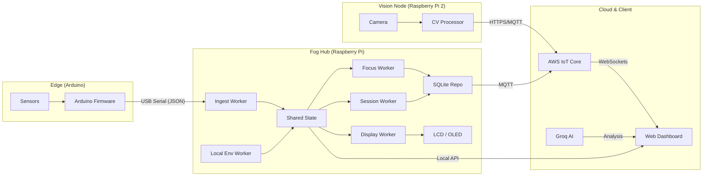

# FocusFlow: Distributed IoT Focus-Assist System

FocusFlow is a modular, distributed IoT system designed to enhance productivity using the Pomodoro technique, environmental monitoring, and computer vision. It features a Raspberry Pi "Fog Hub", an Arduino sensor node, and a modern web dashboard for real-time visualization and AI-powered session reporting.

---

## ✅ Key MVP Features

- **Session Management**: Automatic 25-minute focus and 5-minute break timers with start/pause/resume/stop controls via hardware buttons.
- **Environmental Monitoring**: Real-time tracking of light, sound, motion, temperature, and humidity.
- **Focus Estimation**: A heuristic-based focus score (0-100) calculated from environmental conditions.
- **Display Integration**: Grove-LCD (RGB) for environment data and Grove-OLED for session countdowns and focus scores.
- **Data Persistence**: Local SQLite database for offline-first reliability.
- **Cloud Synchronization**: Background publishing of telemetry and session events to AWS IoT Core.
- **Web Dashboard**: React/Vite-based interface with live status updates, historical charts, and AI-summarized focus reports.

---

## 🏗️ System Organisation & Data Flow

FocusFlow follows a "Fog Computing" architecture where data is processed locally at the edge for immediate feedback, while critical events are synced to the cloud for long-term analytics.



---

## 📂 Folder and File Structure

### 📂 Root Directory
- `arduino/`: Firmware for the Arduino-based sensor node.
- `raspberry/`: Core "Fog Node" implementation for the primary Raspberry Pi.
- `raspberry-2/`: Computer Vision (CV) processing node for the secondary Raspberry Pi.
- `FocusFlowDashboard/`: A React-based web dashboard for real-time visualization and analytics.
- `docs/`: Comprehensive project documentation following university SDLC standards.
- `iot-lab-book-master/`: Reference implementations and lab exercises used as a foundation.
- `requirements.txt`: Global Python dependencies.
- `SETUP.md`: (Deprecated) Integrated into this README.

### 📂 arduino/main/
The firmware responsible for local sensor polling and data transmission.
- `main.ino`: Primary entry point and setup/loop logic.
- `config.h`: Centralized pin definitions, thresholds, and timing constants.
- `environment_sensors.h`: Logic for reading Light, Sound, PIR, and DHT sensors.
- `payload_formatter.h`: Handles JSON serialization for data transmission to the Pi.
- `usbserial_transport.h`: Manages serial communication over USB.

### 📂 raspberry/
The "Brain" of the system, handling session logic, data persistence, and display updates.
- `main.py`: Entry point for the fog node.
- `fog/`: Core logic package containing multi-threaded workers for ingestion, session management, and focus calculation.
- `focusflow_mvp.db`: Local SQLite database storing telemetry and session events.

---

## 🛠️ Setup Instructions

### 1. Prerequisites
- **AWS Account**: Access to AWS IoT Core for cloud communication.
- **Python 3.9+**: Installed on both Raspberry Pi units.
- **Node.js 18+**: Installed for the Dashboard.
- **Arduino IDE**: For flashing the edge device firmware.
- **Hardware**: Arduino board, Raspberry Pi (Hub), Raspberry Pi (CV Node).

### 2. Hardware Wiring (Arduino)
Connect sensors to the specified pins as defined in `arduino/main/config.h`:
- **Light Sensor**: Analog Pin `A3`
- **Sound Sensor**: Analog Pin `A0`
- **PIR Motion Sensor**: Digital Pin `D2`
- **Button**: Digital Pin `D3` (Momentary, active LOW)
- **Ultrasonic Ranger**: Digital Pin `D7`
- **DHT Sensor**: Digital Pin `D4` (connected via GrovePi or directly)

### 3. Installation
#### Arduino Edge Device
1. Open `arduino/main/main.ino` in the Arduino IDE.
2. Install the **DHT sensor library** (by Adafruit) via the Library Manager.
3. Connect your Arduino and flash the code.

#### Raspberry Pi (Central Hub)
1. Navigate to `raspberry/` and install system dependencies:
   ```bash
   curl -kL https://get.pimoroni.com/grovepi | bash
   pip3 install -r requirements.txt
   ```
2. Run the initialization script:
   ```bash
   chmod +x start.sh && ./start.sh
   ```

#### FocusFlow Dashboard
1. Navigate to `FocusFlowDashboard/` and install dependencies:
   ```bash
   npm install
   ```

### 3. Configuration
- **AWS IoT**: Place your device certificates (`cert.pem`, `private.key`) in the `raspberry/` and `raspberry-2/` folders as appropriate.
- **Environment**: Copy `.env.example` to `.env` in the `FocusFlowDashboard/` directory and provide your `GROQ_API_KEY`.

---

## 🚀 Running the Project

### 1. Start the Hub & Edge
Plug the Arduino into the Central Pi via USB, then start the Fog service:
```bash
cd raspberry
python3 main.py
```

### 2. Start the CV Node
Run the vision script on the camera-equipped Pi:
```bash
cd raspberry-2
python3 basicCV.py --headless --hub-url http://<HUB_IP>:8787/api/peer-ingest
```

### 3. Start the Dashboard
Launch both the Vite frontend and Express backend:
```bash
cd FocusFlowDashboard
npm run dev:all
```
Access the UI at `http://localhost:5173`.

---

## 📊 Telemetry & Communication

### Arduino → Hub (JSON over Serial)
The Arduino node sends telemetry every 1 second in the following format:
```json
{ "v": 1, "light": 412, "sound": 275, "move": 1, "button": 0 }
```
It also sends discrete events for button interactions:
```json
{"v": 1, "btn_event": "SHORT"}
{"v": 1, "btn_event": "LONG"}
```

### Hub → Cloud (MQTT)
The Hub publishes data to AWS IoT Core on the following topics:
- `focusflow/environment`: Real-time sensor readings.
- `focusflow/session`: Session state changes (started, paused, stopped).
- `focusflow/focus`: Calculated focus scores and reason codes.

---

## 📦 Third-Party Software and Frameworks

| Software / Framework | Purpose | Documentation |
| :--- | :--- | :--- |
| **Arduino** | Hardware abstraction and sensor firmware platform | [arduino.cc](https://www.arduino.cc/) |
| **AWS IoT Core** | Managed cloud service for MQTT-based device sync | [aws.amazon.com/iot](https://aws.amazon.com/iot-core/) |
| **React** | Frontend library for the Dashboard UI | [react.dev](https://react.dev/) |
| **Vite** | Next-generation frontend tooling and dev server | [vitejs.dev](https://vitejs.dev/) |
| **Express** | Minimalist web framework for the backend API | [expressjs.com](https://expressjs.com/) |
| **OpenCV** | Open-source computer vision library | [opencv.org](https://opencv.org/) |
| **MediaPipe** | ML framework for face and gesture tracking | [mediapipe.dev](https://mediapipe.dev/) |
| **Groq** | High-speed AI inference for session reporting | [groq.com](https://groq.com/) |
| **SQLite** | Self-contained, serverless database engine | [sqlite.org](https://www.sqlite.org/) |

---

## 📄 Code Documentation

- **In-line Comments**: All Python and Arduino source files follow standard PEP8/Google style guides with descriptive comments.
- **Project Docs**: Detailed architectural designs, requirements, and implementation plans are located in the `docs/` directory.
- **Reference Lab Code**: This project builds upon concepts from the `iot-lab-book-master/` reference material:
    - **LAB 02**: DHT sensor reading patterns (used in `LocalEnvironmentWorker`).
    - **LAB 04/06**: MQTT cloud and Full Stack patterns (used in AWS Publisher).
    - **LAB 09**: Pi concurrency and worker orchestration (used in `fog/main.py`).

---

## ❓ Troubleshooting

- **Serial Device Errors**: If the Hub cannot connect to the Arduino, ensure the user has permissions for `/dev/ttyACM0` (`sudo usermod -a -G dialout $USER`).
- **Grove Hardware Not Found**: Verify that I2C is enabled in `raspi-config` and that the GrovePi board is correctly seated.
- **AWS Sync Failures**: Check that the system clock is synchronized (NTP) and that certificates are correctly named in `raspberry/main.py`.
- **Dashboard API Offline**: Ensure port `8787` is not blocked by a firewall and that `concurrently` is installed.
