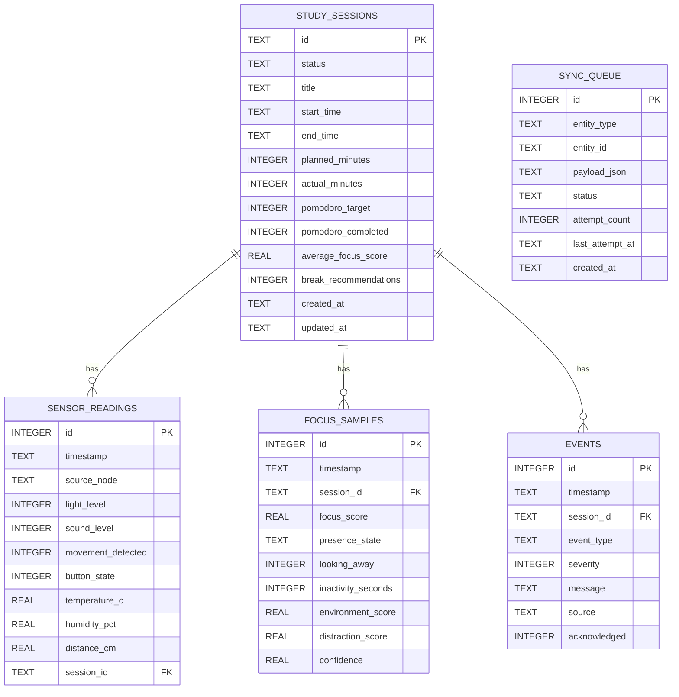

# Data Model And Storage

## Storage Rules

- SQLite on the hub is the source of truth.
- Write local first, sync later.
- Cloud sync must never block session execution.

## Core Tables

- study_sessions: lifecycle and summary data.
- sensor_readings: raw/near-raw periodic sensor values.
- focus_samples: computed focus outputs.
- events: notable system/user events.
- sync_queue: retryable cloud export jobs.

## SQLite Schema

```sql
CREATE TABLE study_sessions (
    id TEXT PRIMARY KEY,
    status TEXT NOT NULL,
    title TEXT,
    start_time TEXT,
    end_time TEXT,
    planned_minutes INTEGER,
    actual_minutes INTEGER,
    pomodoro_target INTEGER,
    pomodoro_completed INTEGER DEFAULT 0,
    average_focus_score REAL,
    break_recommendations INTEGER DEFAULT 0,
    created_at TEXT NOT NULL,
    updated_at TEXT NOT NULL
);

CREATE TABLE sensor_readings (
    id INTEGER PRIMARY KEY AUTOINCREMENT,
    timestamp TEXT NOT NULL,
    source_node TEXT NOT NULL,
    light_level INTEGER,
    sound_level INTEGER,
    movement_detected INTEGER,
    button_state INTEGER,
    temperature_c REAL,
    humidity_pct REAL,
    distance_cm REAL,
    session_id TEXT,
    FOREIGN KEY (session_id) REFERENCES study_sessions(id)
);

CREATE TABLE focus_samples (
    id INTEGER PRIMARY KEY AUTOINCREMENT,
    timestamp TEXT NOT NULL,
    session_id TEXT,
    focus_score REAL NOT NULL,
    presence_state TEXT,
    looking_away INTEGER,
    inactivity_seconds INTEGER,
    environment_score REAL,
    distraction_score REAL,
    confidence REAL,
    FOREIGN KEY (session_id) REFERENCES study_sessions(id)
);

CREATE TABLE events (
    id INTEGER PRIMARY KEY AUTOINCREMENT,
    timestamp TEXT NOT NULL,
    session_id TEXT,
    event_type TEXT NOT NULL,
    severity INTEGER NOT NULL,
    message TEXT,
    source TEXT,
    acknowledged INTEGER DEFAULT 0,
    FOREIGN KEY (session_id) REFERENCES study_sessions(id)
);

CREATE TABLE sync_queue (
    id INTEGER PRIMARY KEY AUTOINCREMENT,
    entity_type TEXT NOT NULL,
    entity_id TEXT NOT NULL,
    payload_json TEXT NOT NULL,
    status TEXT NOT NULL DEFAULT 'pending',
    attempt_count INTEGER NOT NULL DEFAULT 0,
    last_attempt_at TEXT,
    created_at TEXT NOT NULL
);
```

## Relationships

- One study_session -> many sensor_readings.
- One study_session -> many focus_samples.
- One study_session -> many events.
- sync_queue rows reference export payload units.

## ERD



## Retention Defaults

- sensor_readings: every 1-5 seconds.
- focus_samples: every 30 seconds.
- sessions/events: keep for entire project.

## Cloud Boundary

Send:

- session summaries
- focus history
- key events

Do not send by default:

- raw camera frames
- high-frequency debug logs
