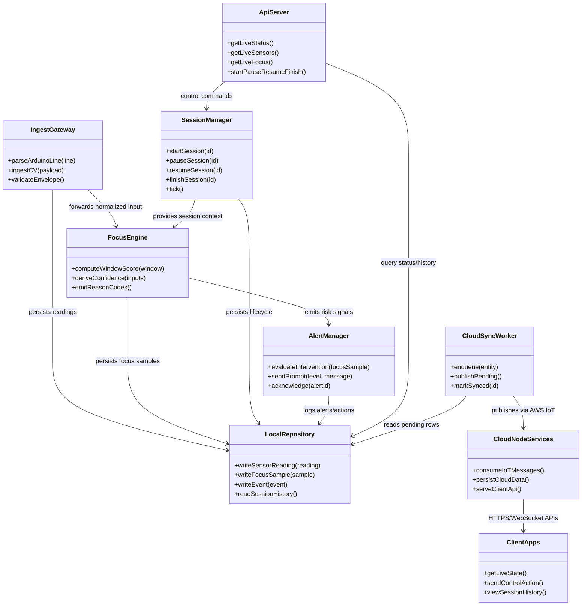
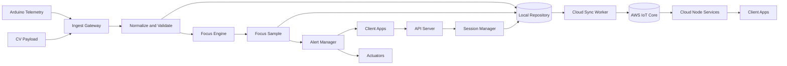
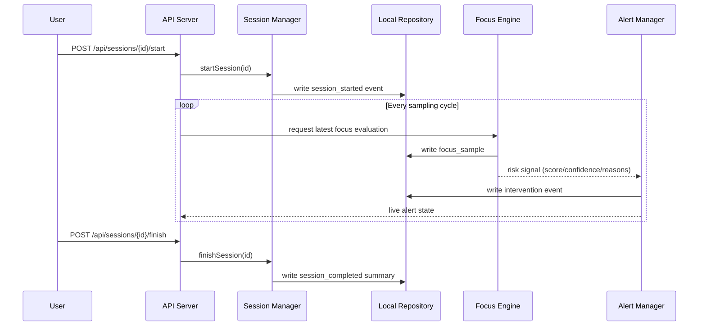

# Software Architecture

## Purpose

This document defines the software architecture for the FocusFlow system, including component responsibilities, interfaces, runtime flows, and decision logic.

This document is intentionally separate from:

- System architecture (hardware and topology): see `SystemArchitecture.md`
- Data architecture and schema: see `ERD.md`

## Architecture Boundaries

In scope:

- Ingesting telemetry from sensor and CV producers
- Managing session lifecycle and Pomodoro behavior
- Computing focus score and confidence
- Triggering interventions and client app updates
- Persisting local records and performing cloud synchronization
- Serving cloud APIs for client apps (web required for MVP)
- Processing remote client commands through cloud pathways

Out of scope:

- Physical wiring, board pinout, and hardware topology
- Detailed database schema and ER relationships

## Software Components

### Layered Allocation

- Edge: Arduino telemetry producer and CV producer.
- Fog: Ingest Gateway, Session Manager, Focus Engine, Alert Manager, Local Repository, Local API.
- Cloud: AWS IoT ingress, Cloud API, cloud persistence, analytics, notifications.
- Clients: web app (MVP).

### Component Responsibilities

- Ingest Gateway: validates and normalizes inbound telemetry/messages.
- Session Manager: controls session state transitions and timers.
- Focus Engine: calculates focus score, confidence, and reason codes.
- Alert Manager: issues interventions (buzzer/display/UI warnings) by severity.
- Local API Server: serves fog-local state, actions, and fallback endpoints.
- Local Repository: local-first persistence and retrieval abstraction.
- Cloud Sync Worker: retries and publishes unsynced records to AWS IoT Core.
- Cloud Node Services: consume AWS IoT data, persist cloud records, and expose client APIs.
- Client Apps: web UX for MVP.

### UML Component View



## Runtime Behavior

### Operational Flow



### Session Control Sequence



## Interface And Message Contracts

### Arduino to Ingest Gateway

Transport: USB serial, one JSON line per sample.

Format:

```json
{
  "v": 1,
  "light": 412,
  "sound": 275,
  "move": 1,
  "temp": 22.4,
  "hum": 46.1,
  "distance_cm": 71
}
```

Rules:

- Newline separates messages.
- JSON is newline-delimited.
- Unknown keys are ignored.
- Invalid lines are logged and dropped.

### CV Node to Ingest Gateway

Required transport: local HTTP POST.

Payload:

```json
{
  "timestamp": "2026-03-16T14:25:00Z",
  "face_present": true,
  "looking_away": false,
  "head_pose": "forward",
  "confidence": 0.84
}
```

### API Surface (Client Apps)

Session endpoints:

- POST /api/sessions
- POST /api/sessions/{id}/start
- POST /api/sessions/{id}/pause
- POST /api/sessions/{id}/resume
- POST /api/sessions/{id}/finish
- GET /api/sessions/active
- GET /api/sessions/history

Live endpoints:

- GET /api/live/status
- GET /api/live/sensors
- GET /api/live/focus
- GET /api/events/recent

Notes:

- Client apps call cloud APIs as the default path.
- Fog-local API is retained as a fallback path when cloud connectivity is unavailable.

### Cloud Integration Pattern

- Write locally first.
- Publish unsynced records in a worker to AWS IoT Core.
- Mark synced only after successful publish.
- Cloud node services consume IoT messages and expose client-facing APIs.

Topics:

```text
focusflow/hub/session_summary
focusflow/hub/focus_sample
focusflow/hub/environment_event
```

## Focus Engine Design

### Input Set

- CV: face_present, looking_away, head_pose, confidence
- Hub: button input (session control)
- Arduino: Grove light, sound, movement, temp/humidity, distance_cm
- Derived: inactivity_seconds

### Window and Scoring

- Rolling window: 30 seconds
- Start score: 100
- Penalties:
  - -25 if face mostly absent
  - -20 if looking_away_ratio > 0.4
  - -10 if average noise above threshold
  - -10 for repeated noise spikes
  - -10 if light below threshold
  - -5 if temperature outside comfort band
  - -5 if humidity outside comfort band
  - -10 if inactivity > 180s with uncertain presence
- Final score clamped to range 0..100

### Break Recommendation

Recommend break when focus score is below 50 for two consecutive windows.

### Confidence and Fallback

- High: CV + presence + environment available
- Medium: CV degraded quality (low confidence), other sensors available
- Low: partial data only

Fallback behavior:

- CV unavailable: focus confidence becomes low and interventions are softened until CV recovers
- USB serial down: continue with hub-local signals
- All inputs down: focus state marked unknown

### Focus Output Contract

- timestamp
- session_id
- focus_score
- presence_state
- looking_away
- environment_score
- distraction_score
- confidence
- reason_codes

Reason code examples:

- presence_lost
- high_noise
- low_light
- looking_away
- comfort_out_of_range

## Session Management Design

### Session States

- planned
- active_focus
- active_break
- paused
- completed
- cancelled

### Typical Lifecycle

1. Create or select session.
2. Start -> active_focus.
3. Focus block ends or break recommended -> active_break.
4. Resume focus blocks until completion.
5. Finish or cancel.

### Pomodoro Defaults

- Focus: 25 minutes
- Short break: 5 minutes
- Long break: 15 minutes after 4 focus blocks

### Break Recommendation Rules

Recommend break when any condition is true:

- focus_score < 50 for 2 windows
- repeated looking_away or unstable presence
- sustained poor environment
- focus timer completed

Recommendations create events and prompts; they do not force behavior in MVP.

### Interventions

- Display text prompt
- Buzzer pulse
- Client app warning banner
- Status color update

Severity levels:

- info
- warning
- critical

### Manual Actions

- start
- pause
- resume
- skip break
- acknowledge alert
- finish early

All manual actions are logged as events.

### Failure Behavior

- Session clock continues unless user stops it.
- Confidence degrades when inputs drop.
- Remaining sensors continue to operate.
- Failure events are always logged.

### Session Summary Fields

- planned_duration
- actual_duration
- focus_blocks_completed
- breaks_taken
- average_focus_score
- top_reason_codes
- environment_summary

## Non-Functional Software Requirements

- Local-first operation when network is unavailable
- Idempotent actuator commands
- Retry-safe cloud publishing
- Clear protocol versioning in Arduino payload via `V`
- Degraded-mode continuity during partial subsystem failure
- CV pipeline is mandatory for full-quality focus scoring
- Cloud pathway is mandatory for remote client app experience

## Versioning and Compatibility

- Protocol version is embedded in Arduino messages using key `V`.
- Ingest Gateway should ignore unknown keys for forward compatibility.
- API changes should remain backward compatible for client apps within the same major version.
