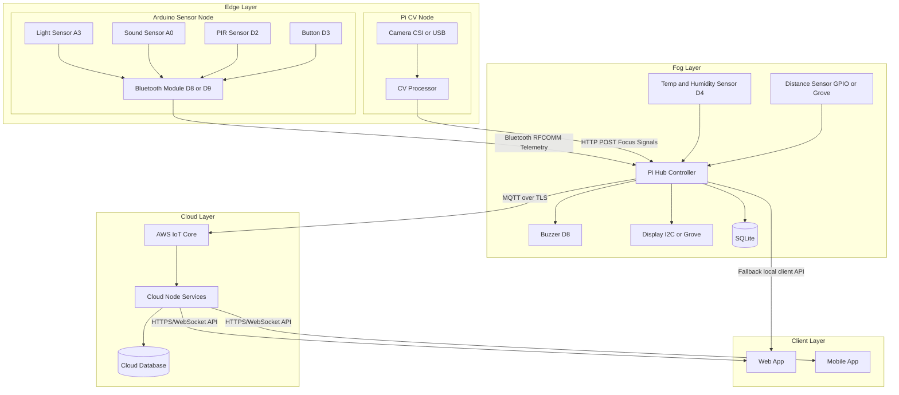
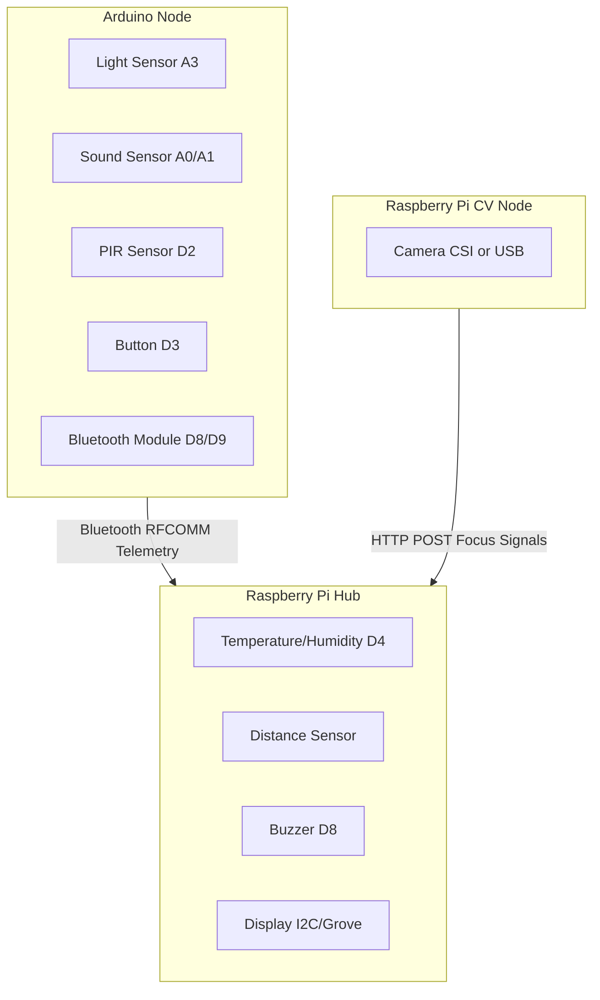

# System Architecture

## Components

- Edge node (Arduino): reads light/sound/PIR/button and sends telemetry.
- Edge CV node (Raspberry Pi CV): captures camera signals and sends focus-related features.
- Fog node (Raspberry Pi hub): system of record, controller, and local inference/orchestration.
- Cloud node: cloud-side processing and integration services.
- AWS IoT Core: essential cloud message ingress, routing, and device connectivity.
- Client apps: web client required for MVP, mobile client optional after MVP.

## Topology

## Fog Node Modules (Pi Hub)

- sensor_ingest: parse Arduino + local sensor input.
- focus_engine: compute focus score.
- session_manager: Pomodoro/session state machine.
- alert_manager: buzzer/display/client-app prompts.
- local_api_server: local API endpoints for operations and fallback UX.
- cloud_sync: publish telemetry/events to AWS IoT and retry unsynced records.

## Cloud Node Modules

- iot_ingest: subscribe to AWS IoT topics and normalize payloads.
- cloud_api: serve web client APIs for MVP and optional mobile APIs post-MVP.
- cloud_analytics: aggregate trends, session summaries, and insights.
- cloud_storage_writer: persist data to cloud database/object storage.
- notification_router: send push or alert events to client apps.

## Data Flows

1. Live flow

- Arduino + CV -> fog ingest -> SQLite + focus/session -> local alerts.
- Fog -> AWS IoT -> cloud node -> client apps (web live state for MVP, optional mobile later).

2. Sync flow

- SQLite unsynced rows -> cloud_sync -> AWS IoT -> cloud node persistence -> ack -> mark synced.

3. Client interaction flow

- Client apps -> cloud API -> control/update request -> AWS IoT command topic -> fog node action.

## Protocol Choices

- Edge Arduino -> fog hub: newline-delimited key/value text over RFCOMM.
- Edge CV -> fog hub: local HTTP POST (essential path).
- Fog -> AWS IoT Core: MQTT over TLS (essential path).
- Cloud node -> client apps: HTTPS REST + WebSocket for live updates.
- Client apps -> cloud node: authenticated HTTPS.

## Architecture Decisions

- Local-first storage with SQLite.
- CV node is mandatory for focus-aware features.
- AWS IoT Core is mandatory for cloud connectivity.
- Cloud node is mandatory for remote APIs, persistence, and analytics.
- Web client is mandatory for MVP.
- Mobile client is optional post-MVP.
- Layered design is fixed: Edge (sensing), Fog (local control), Cloud (remote services).

## Main Risks

- Bluetooth dropouts.
- Sensor noise causing unstable score.
- CV latency on Pi hardware.
- Cloud connectivity interruptions impacting remote UX.
- API auth/security complexity for client apps.

## Decisions Baseline

MVP decisions are finalized in `../1. Requirements/Requirements-and-Plan.md`.

- CV transport: local HTTP POST.
- Cloud ingress: AWS IoT Core MQTT over TLS.
- Client app live updates: WebSocket preferred, HTTP polling fallback.
- Architecture layers: Edge + Fog + Cloud + Clients are all essential.

## Hardware Mapping

### Board Allocation

- Arduino: light, sound, PIR, button, Bluetooth telemetry.
- Pi hub: distance sensor, buzzer, display, local control.
- Pi CV node: camera and CV processing.

### Hardware Topology

### Sensor And Actuator Table

| Device                          | Board                | Suggested Pin                                   | Voltage / Interface                          | Sampling Rate                  | Purpose                                                        |
| ------------------------------- | -------------------- | ----------------------------------------------- | -------------------------------------------- | ------------------------------ | -------------------------------------------------------------- |
| Light sensor                    | Arduino              | A3                                              | Analog, typically 5V on Grove/Arduino side   | 1 Hz                           | Measure ambient lighting quality                               |
| Sound sensor                    | Arduino              | A0 or A1                                        | Analog, typically 5V on Arduino side         | 2 Hz to 5 Hz                   | Estimate environmental noise and distraction level             |
| PIR movement sensor             | Arduino              | D2                                              | Digital input, 5V logic                      | 2 Hz                           | Detect movement near the desk                                  |
| Button or LED button input      | Arduino              | D3                                              | Digital input, 5V logic                      | event-driven                   | Manual start, pause, acknowledgement, or intervention controls |
| Bluetooth module                | Arduino              | D8 RX, D9 TX                                    | SoftwareSerial UART                          | continuous                     | Send telemetry to the hub                                      |
| Temperature and humidity sensor | Raspberry Pi hub     | D4 on GrovePi or equivalent                     | Digital Grove / DHT / I2C depending on model | 0.2 Hz to 0.33 Hz              | Measure room comfort conditions                                |
| Distance sensor                 | Raspberry Pi hub     | Grove ultrasonic port or GPIO trigger/echo pair | Digital GPIO or Grove                        | 1 Hz to 2 Hz                   | Presence estimation and desk distance monitoring               |
| Buzzer                          | Raspberry Pi hub     | D8 on GrovePi or GPIO output                    | Digital output                               | event-driven                   | Gentle audio interventions                                     |
| Display screen                  | Raspberry Pi hub     | I2C or Grove display port                       | I2C / Grove                                  | update on state change or 1 Hz | Local feedback and timer display                               |
| Camera                          | Raspberry Pi CV node | CSI camera connector or USB                     | CSI / USB                                    | 5 fps to 15 fps for MVP        | Eye tracking, head pose, face presence                         |

### Suggested Pin Plan (MVP)

#### Arduino

- `A3`: light sensor
- `A0`: sound sensor
- `D2`: PIR motion sensor
- `D3`: button input
- `D8`: Bluetooth RX
- `D9`: Bluetooth TX

#### Raspberry Pi Hub

- `D8` on GrovePi or equivalent GPIO: buzzer
- `D4` on GrovePi or equivalent sensor port: temperature and humidity sensor if attached here
- distance sensor: Grove ultrasonic port or assigned GPIO pair
- display: I2C bus or Grove LCD port
