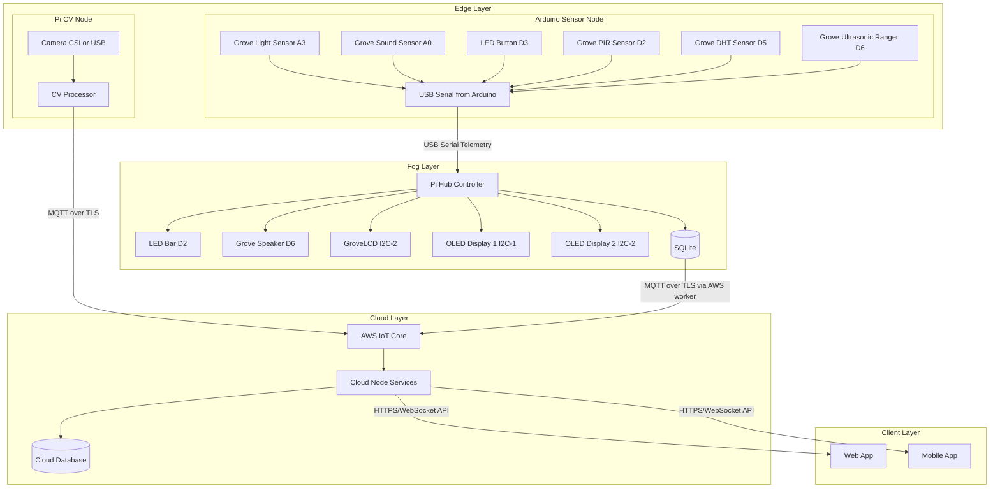
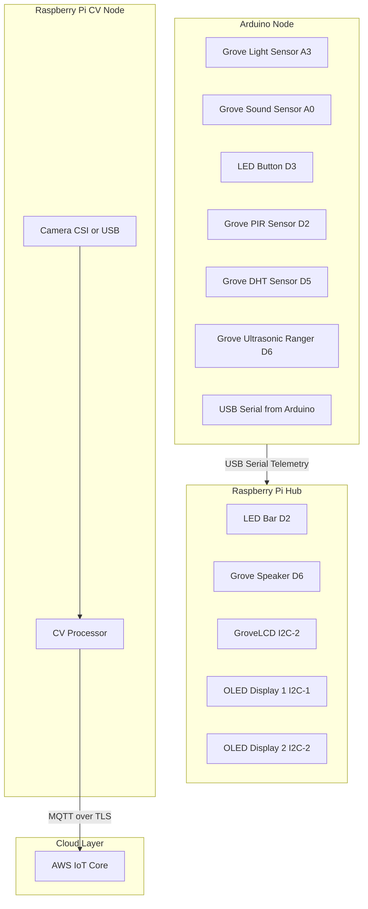

# System Architecture

## Components

- Edge node (Arduino): reads sound/light/temp-humidity/PIR/distance/LED-button input and sends telemetry.
- Edge CV node (Raspberry Pi CV): captures camera signals and sends focus-related features directly to cloud.
- Fog node (Raspberry Pi hub): system of record, controller, and local inference/orchestration.
- Cloud node: cloud-side processing and integration services.
- AWS IoT Core: essential cloud message ingress, routing, and device connectivity.
- Client apps: web client required for MVP, mobile client optional after MVP.

## Topology

## Fog Node Modules (Pi Hub)

- `config.py`: environment-driven configuration and tuning values.
- `repository.py`: SQLite-backed repository for environment, session, and focus logs.
- `state.py`: in-memory `SharedState` snapshot used by workers.
- `session.py`: `SessionManager` implementing Pomodoro/session state transitions.
- `display.py`: `LedEnvironmentDisplay` and `OledSessionDisplay` renderers for local outputs.
- `workers.py`: background workers:
  - `ArduinoIngestWorker`: reads Arduino serial telemetry and writes environment rows to SQLite.
  - `SessionWorker`: handles button events and session ticking, persisting session events.
  - `FocusWorker`: computes focus score periodically and writes focus rows.
  - `DisplayWorker`: renders environment/session/focus to the LED bar and OLED displays.
  - `AwsIotPublisherWorker` (optional): polls the `repository` (SQLite) and publishes new rows to AWS IoT.
- `main.py`: start/shutdown orchestration wiring `SharedState`, `Repository`, and workers.
- `utils.py`: small helpers (`utc_now_iso`, JSON parsing, clamping) used across modules.

## Cloud Node Modules

- iot_ingest: subscribe to AWS IoT topics and normalize payloads.
- cloud_api: serve web client APIs for MVP and optional mobile APIs post-MVP.
- cloud_analytics: aggregate trends, session summaries, and insights.
- cloud_storage_writer: persist data to cloud database/object storage.
- notification_router: send push or alert events to client apps.

## Data Flows

1. Live flow

- Arduino -> fog ingest -> SQLite + focus/session -> local alerts.
- AwsIotPublisherWorker -> polls SQLite and publishes new environment/session/focus rows to AWS IoT -> cloud node.
- CV -> AWS IoT -> cloud node for direct CV telemetry/signals.

2. Sync flow

- SQLite unsynced rows -> cloud_sync -> AWS IoT -> cloud node persistence -> ack -> mark synced.

3. Client interaction flow

- Client apps -> cloud API -> control/update request -> AWS IoT command topic -> fog node action.

## Protocol Choices

- Edge Arduino -> fog hub: newline-delimited JSON over USB serial.
- Edge CV -> AWS IoT Core: MQTT over TLS for direct cloud telemetry.
- Fog -> AWS IoT Core: MQTT over TLS (essential path).
- Cloud node -> client apps: HTTPS REST + WebSocket for live updates.
- Client apps -> cloud node: authenticated HTTPS.

## Architecture Decisions

- Local-first storage with SQLite.
- CV node is mandatory for focus-aware features.
- AWS IoT Core is mandatory for cloud connectivity.
- Cloud node is mandatory for remote APIs, persistence, and analytics.
- Web client is mandatory for MVP.
- Mobile client is optional post-MVP.
- Layered design is fixed: Edge (sensing), Fog (local control), Cloud (remote services).

## Main Risks

- USB serial disconnects.
- Sensor noise causing unstable score.
- CV latency on Pi hardware.
- Cloud connectivity interruptions impacting remote UX.
- API auth/security complexity for client apps.

## Decisions Baseline

MVP decisions are finalized in `../1. Requirements/Requirements-and-Plan.md`.

- CV transport: MQTT over TLS direct to AWS IoT Core.
- Cloud ingress: AWS IoT Core MQTT over TLS.
- Client app live updates: WebSocket preferred, HTTP polling fallback.
- Architecture layers: Edge + Fog + Cloud + Clients are all essential.

## Hardware Mapping

### Board Allocation

- Arduino: Grove sound, light, DHT, LED button, PIR, ultrasonic ranger, USB serial telemetry.
- Pi hub: GroveLCD, OLED Display 1, OLED Display 2, LED Bar, Grove Speaker, local control.
- Pi CV node: Raspberry Pi camera and CV processing.

### Hardware Topology

### Sensor And Actuator Table

| Device                          | Board                | Suggested Pin               | Voltage / Interface            | Sampling Rate                  | Purpose                                            |
| ------------------------------- | -------------------- | --------------------------- | ------------------------------ | ------------------------------ | -------------------------------------------------- |
| Light sensor                    | Arduino              | A3                          | Grove analog sensor            | 1 Hz                           | Measure ambient lighting quality                   |
| Sound sensor                    | Arduino              | A0                          | Grove analog sensor            | 2 Hz to 5 Hz                   | Estimate environmental noise and distraction level |
| LED button input                | Arduino              | D3                          | Digital input (with LED)       | event-driven                   | Manual local input and interaction state           |
| PIR movement sensor             | Arduino              | D2                          | Grove digital sensor           | 2 Hz                           | Detect movement near the desk                      |
| USB serial connection           | Arduino              | USB port                    | Native USB serial              | continuous                     | Send telemetry to the hub                          |
| Temperature and humidity sensor | Arduino              | D5                          | Grove DHT digital interface    | 0.2 Hz to 0.33 Hz              | Measure room comfort conditions                    |
| Distance sensor                 | Arduino              | D6                          | Grove ultrasonic ranger signal | 1 Hz to 2 Hz                   | Presence estimation and desk distance monitoring   |
| LED bar                         | Raspberry Pi hub     | D2                          | Digital GPIO / Grove           | event-driven                   | Visual intervention intensity and state feedback   |
| Grove speaker                   | Raspberry Pi hub     | D6                          | Digital/PWM output             | event-driven                   | Audio interventions and alerts                     |
| GroveLCD                        | Raspberry Pi hub     | I2C-2                       | I2C / Grove                    | update on state change or 1 Hz | Main local status and timer display                |
| OLED display 1                  | Raspberry Pi hub     | I2C-1                       | I2C                            | update on state change or 1 Hz | Secondary local metrics display                    |
| OLED display 2                  | Raspberry Pi hub     | I2C-2                       | I2C                            | update on state change or 1 Hz | Additional local context display                   |
| Camera                          | Raspberry Pi CV node | CSI camera connector or USB | CSI / USB                      | 5 fps to 15 fps for MVP        | Eye tracking, head pose, face presence             |

### Suggested Pin Plan (MVP)

#### Arduino

- `A3`: light sensor
- `A0`: sound sensor
- `D3`: LED button input
- `D2`: PIR motion sensor
- `D5`: Grove DHT sensor
- `D6`: Grove ultrasonic ranger
- USB: Arduino serial connection to the Pi

#### Raspberry Pi Hub

- `D2`: LED Bar
- `D6`: Grove Speaker
- `I2C-2`: GroveLCD
- `I2C-1`: OLED Display 1
- `I2C-2`: OLED Display 2
